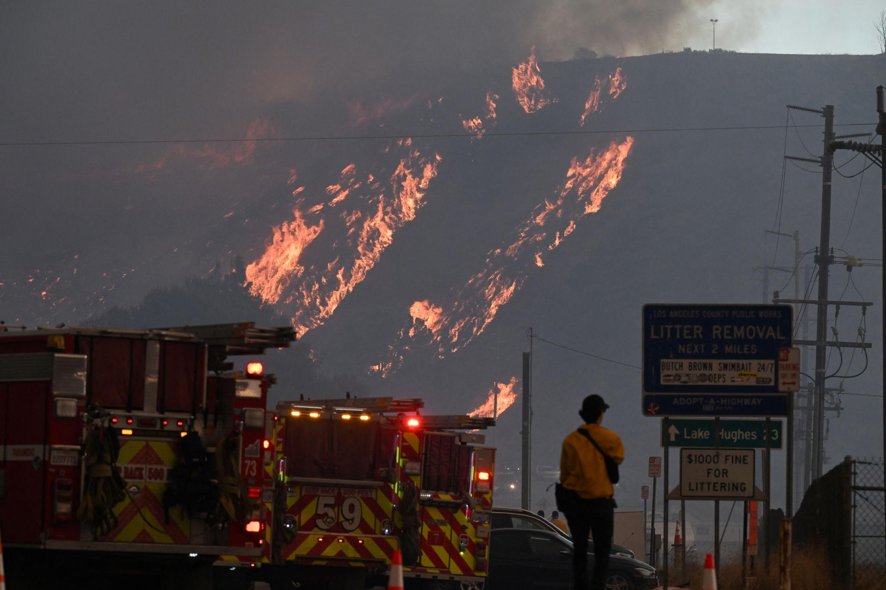
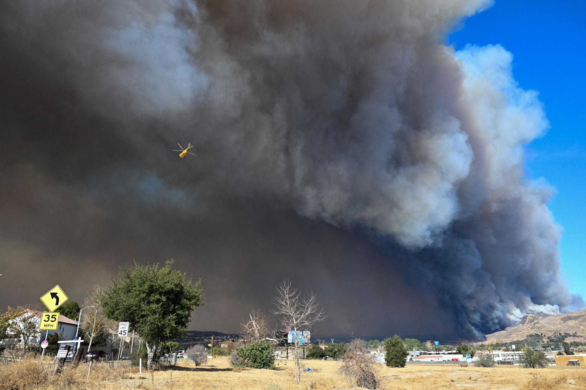
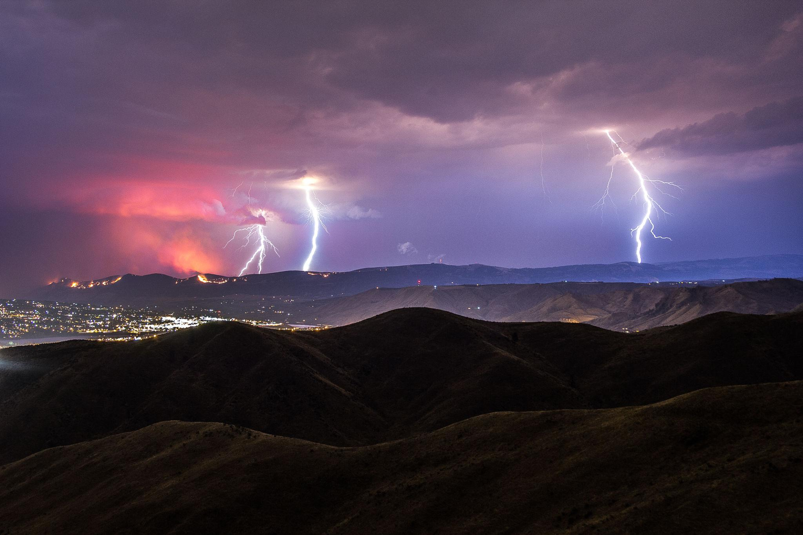

2024年加州最大野火：燃烧汽车与闪电引发连锁火灾

图 1 2024年7月，加利福尼亚州北部帕克山火的火焰在干燥植被和山区地形中蔓延。强风和极度干燥的环境使野火迅速扩大，并威胁到附近社区。

2024年夏季，美国西部再次迎来严重的野火季节，而加利福尼亚州再次成为这场危机的中心。

当局表示，当年规模最大的野火之一——被称为“帕克山火”——很可能是由于一辆燃烧的汽车被推入沟谷而引发的。汽车的火焰点燃了周围干燥的植被，并迅速蔓延到附近的森林和山坡。

短短几天内，大火迅速扩大，在加州北部奇科市附近烧毁了超过195平方英里（约505平方公里）的土地。随着火势蔓延至布特县和特哈马县，成千上万名居民被下令撤离，房屋、森林以及关键基础设施都受到威胁。

在火灾早期阶段，火势的控制率仅为3%，这凸显了消防员在遏制迅速蔓延的火焰时所面临的巨大困难。

### 受到威胁的社区

图 2 在加利福尼亚州北部，消防员使用重型设备和空中支援来控制野火，并努力保护附近社区的住宅。

随着火势扩大，应急救援人员将重点放在保护建筑物以及协助脆弱社区居民撤离上。在科哈塞特等地区，居民表示他们看到明亮的橙色火焰沿着山坡攀升，浓烟笼罩着天空。

消防员报告称，强风将燃烧的火星吹到主火线之外，有时会在最远一英里（约1.6公里）的地方引发新的小型火点。这样的条件使火势控制变得极为困难，并迫使当局不断扩大撤离区域。

推土机和消防飞机被部署来建立防火隔离带，以减缓火势蔓延，同时也为被迫撤离的居民开放了紧急避难所。

### 闪电与美国西部的多起火灾

图 3 夏季风暴中的闪电在美国西部多地引发野火，包括加州北部的“金色综合火灾”

帕克山火并不是该地区唯一的火灾威胁。在加州东北部、靠近内华达州边界的地区，闪电引发了“金色综合火灾”。这是一系列野火，在普卢马斯国家森林烧毁了超过4平方英里（约10平方公里）的灌木和森林土地。

由于发布了撤离命令，大约1000人被迫离开家园，尽管最初没有报告重大人员伤亡或建筑损毁。然而，强风和炎热天气使消防人员在数天内都难以控制火势。

与此同时，太平洋西北地区的雷暴也在俄勒冈州、爱达荷州和蒙大拿州等地引发了数十起新的野火，显示出2024年夏季野火威胁的广泛程度。

### 一个日益加剧的区域性火灾危机

在同一时期，美国西部大部分地区以及加拿大部分地区都报告了野火。在俄勒冈州东部，“杜尔基火灾”燃烧面积接近630平方英里（约1630平方公里），一度成为当时美国最大的活跃野火之一。

极端高温、长期干旱以及强风为火灾蔓延创造了理想条件。气象学家记录到，在某一天里，俄勒冈州和爱达荷州部分地区就出现了数千次闪电，从而在整个地区点燃了大量新的火点。

与此同时，大型火灾产生的烟雾扩散到多个州，多个城市因此发布了空气质量警报。

### 气候变化与未来的野火

科学家和火灾专家表示，气候变化正在越来越多地影响美国西部野火的强度和发生频率。气温上升、长期干旱以及植被日益干燥，使火灾更容易被点燃并迅速扩散。

研究人员还警告说，随着气候模式发生变化，由闪电引发的火灾可能会变得更加常见，特别是在太平洋西北地区和加拿大西部。

对于生活在高火灾风险地区的社区来说，2024年的野火季再次提醒人们：自然灾害、极端天气以及人类活动可能共同作用，从而引发具有破坏性的灾难。