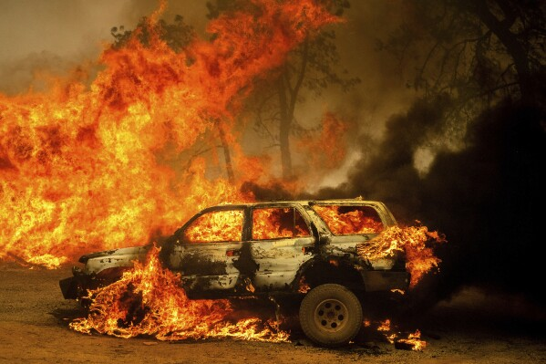
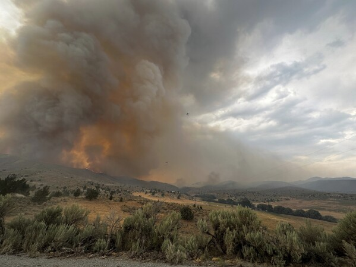
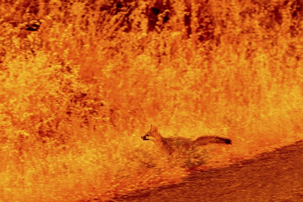

美国西部野火肆虐：闪电与被推入沟谷的燃烧汽车疑为起因

当局周四表示，一辆被推进沟谷的燃烧汽车引发了加州今年最大的野火，并宣布已逮捕一名嫌疑人。同时，美国西北太平洋地区的其他野火也在持续蔓延。

据称由该男子引发的火焰迅速扩大，形成了如今的“帕克山火”。这场火灾在奇科市附近已经烧毁超过195平方英里（505平方公里）的土地。比尤特县和特哈马县已发布疏散命令，截至周四晚间火势仅控制了3%。

加州当局尚未立即公布被捕男子的姓名。

图 1 2024年7月25日星期四，在加利福尼亚州比尤特县科哈塞特社区，帕克山火席卷而过，火焰吞噬了一辆汽车和一栋建筑。（美联社照片 / Noah Berger）

此外，在加州靠近内华达州边界的地区，由闪电引发的“金色复合火灾（”已烧毁约4平方英里（10平方公里）的灌木和林地。美国林务局发言人Adrienne Freeman表示，自周一晚发布疏散命令以来，大约1000人仍然无法返回家园。火灾发生在普卢马斯国家森林，位于内华达州里诺西北约50英里（80公里）处。

在靠近内华达州边界、波托拉西南方向的这组火灾中，目前尚无建筑受损、死亡或严重受伤的报告。但截至周四，火势仍然完全未被控制。

美国林务局行动部门负责人Tom Browning周四下午表示：

“我们在控制火势方面取得了一些非常好的进展，但天气炎热、干燥，而且风力很大……在大风和高温条件下，我们的防火线仍然难以完全控制火势。”

图 2在美国农业部林务局提供的这张图片中，2024年7月22日星期一，俄勒冈州杜尔基附近的野火升起浓烟。在俄勒冈州东部，周三晚的一场强雷暴带来了降雨和较低气温，使得当地约630平方英里（1630平方公里）被烧毁的地区火势有所缓解。杜尔基山火以及附近另一场火灾此前是美国最大的活跃野火。周四，人口约500人的亨廷顿市的疏散命令已被解除。（美联社照片 / USDA Forest Service via AP）

金色复合火灾的现场指挥官Tim Fike表示，阵风也在给帕克山火的消防队带来困难，导致主防火线之外一英里范围内不断出现新的“飞火点”。

他说：“这目前是帕克山火最大的一个问题。”

随着加州持续疏散，一些俄勒冈州居民在雷暴带来降雨后被允许返回家园。但雷暴也伴随着可能引发新火灾的危险闪电。与此同时，蒙大拿州在周三和周四凌晨新增了20多起野火，而加拿大的一场快速蔓延的山火也迫使数千人撤离一座城镇。

在俄勒冈州东部，由于周三晚的强雷暴带来降雨和降温，亨廷顿市的疏散命令被解除。此前杜尔基山火及附近火灾已烧毁近630平方英里（1630平方公里）的土地，是美国最大的野火。

图3 2024 年 7 月 25 日（周四），在加利福尼亚州比尤特县的科哈塞特社区，一场名为“公园大火”的火灾肆虐之际，一只动物在草丛中奔跑，躲避熊熊燃烧的火焰.(美联社照片/Noah Berger）

白宫表示，美国总统乔·拜登周四晚致电俄勒冈州州长蒂娜·科特克，表示联邦政府将提供支持，确保该州拥有扑灭火灾所需的一切资源。

贝克县警长Travis Ash称这场降雨是“天赐之物”。俄勒冈州消防局表示，消防员将“抓住这一机会”在俄勒冈—爱达荷边界推进灭火工作。但火势仍然难以预测，目前仅控制约20%。

美国林务局向博伊西当地电视台KBOI-TV表示，爱达荷州一夜之间因闪电引发了15起新的火灾，但其中一些在周四下午之前已经被扑灭。美国国家气象局称，仅周三一天，在俄勒冈东南部和爱达荷州就记录到超过2800次云对地闪电。

总体而言，今年夏天到目前为止，美国西北太平洋地区已有约1562平方英里（4045平方公里）的土地被烧毁。仅俄勒冈州就有34场大型火灾，几乎全部集中在该州中部和东部地区。

气候变化正在增加太平洋西北地区和加拿大西部由闪电引发野火的频率。该地区正在经历破纪录的高温，多日气温超过100华氏度（约38摄氏度），空气极度干燥。

爱达荷电力公司首次实施预防性停电措施，为防止高风速导致电线倒塌引发新的火灾，向数千名用户暂时切断电力供应。

在加州北部，消防人员正集中精力进行疏散和保护建筑，并使用推土机在帕克山火前方开辟防火隔离带。比尤特县消防局表示，目前尚未报告人员死亡或建筑受损。

在加州南部，一场规模较小但蔓延迅速的火灾也在威胁住宅。

周三晚，圣迭戈县发布疏散命令，因为一场野火在靠近里弗赛德县边界的地区迅速扩散。消防官员表示，“格罗夫山火”正在向东南方向蔓延，地形陡峭且扑救困难。该火灾一夜之间扩大至1.4平方英里（3.6平方公里），截至周四下午控制率为10%。

在蒙大拿州，由于高温、低湿度和强风，中部地区发布了火灾警报。风暴前沿东侧还发布了极端高温警报，气温可能升至108华氏度（42摄氏度）。在米苏拉地区，接近飓风级别的大风吹倒树木、电线和天然气管道，当局警告居民远离河流，因为河水可能被电线导电。

在加拿大落基山脉的贾斯珀国家公园，一场快速蔓延的野火本周袭击了同名城镇，迫使数千人撤离，并对这一世界遗产地造成严重破坏。

这场火灾以及美国西部的其他野火还导致空气质量警报，天空充满烟雾和雾霾。